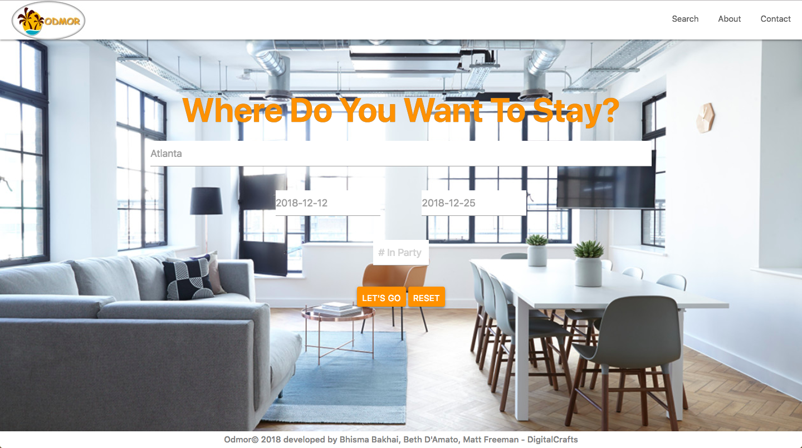
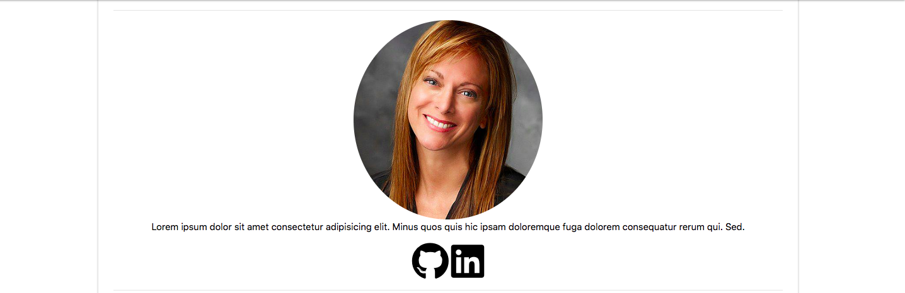
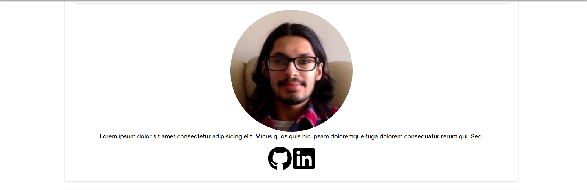
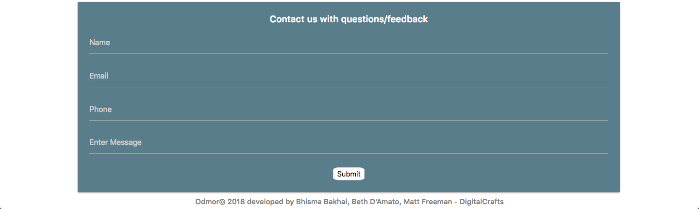

# Odmor Travel Application
DC Group Project #1 - June 6, 2018

## Authors

* **Matthew Freeman** - [matthewfreeman821](https://github.com/matthewfreeman821)
* **Beth D'Amato** - [badamato](https://github.com/badamato)
* **Bhisma Bakhai** - [Bhisma93](https://https://github.com/Bhisma93)

## Built With

* JavaScript ES5
* jQuery 3.3.1
* HTML5/CSS3
* Sketch
* Trello
* [OpenWeatherMap](https://openweathermap.org/) - Used location API to get coordinates
* [Amadeus](https://api.sandbox.amadeus.com/v1.2/hotels/search-circle) - Amadeus Travel API
* [Google Maps](https://maps.googleapis.com/maps/api/js?key=) - Google Maps API

## Development Process
* [1. Concept](#1-concept)
* [2. Initial Planning](#2-initial-planning)
* [3. Accessing APIs](#3-accessing-apis)
* [4. Obstacles and Breakthroughs!](#4-obstacles-and-breakthroughs)
* [5. Future Additions](#5-future-additions)

### 1. Concept

After brainstorming, our idea began with the idea of an application that would help make travel and stay for the user more efficient. The user is able to put in any city in the world followed by the dates of their stay/departure, and the application would be able to display the five nearest places to stay in that given destination. We are able to give out more than five places to stay, but decided to stick with five for the purpose of display for the application.

### 2. Initial Planning

Originally we were going to create and Airbnb style clone, with a few other amenities, but we were having issues with their API. We stumbled upon the Amadeus API while searching for other travel APIs to implement in place of the Airbnb API. The Amadeus API was able to give us all the information we would need and more about hotels in the area instead of peoples homes like Airbnb. After some thought we decided to just use Amadeus and make a travel application that would use the hotel information combined with google maps to display and produce the most afordable and closest places to live within the city the user would want to visit. We found for Amadeus to function with the map we would need the longitude and lattitude of the city the user would be visiting, which is why we included the OpenWeathMap. We decided to go with the name Odmor which is Serbo-Croation for vacation, holiday, or taking a pause. We went with this name because we wanted to use something different while still being able to express our desire to wanting to travel, explore, and just take a pause from our day to day life. 

### 3. Accessing APIs

We utilized OpenWeatherMap’s API by utilizing the user’s input as part of the query. This returned a longitude and latitude for the city. We then utilize the longitude and latitude to query Amadeus’ API to return hotel information for the city the user has inputted. After storing the necessary data in variables, the longitude and latitude are utilized to query Google Maps to render a map with the city being the center of the map.

<h2>About</h2>

<h3>Matt</h3>

<h3>Beth</h3>

<h3>Bhisma</h3>

### 4. Obstacles and Breakthroughs

Some of the major challenges we faced were getting access to API's, adapting to using a large framework like materialize, and learning how cooperate in using github to push, pull, and merge files.

The largest hurdles we faced from the start were being able to find API's which were free to access, specifically in the travel based industry. After reaching out to companies and doing research we were finally able to find API's and get access pretty easily. Then using user input in the API's was a bit of a challenge at first. Once the dynamic information was understood and able to be hardcoded things began to click much quicker.

Creating the website using the popular CSS framework Materialize was also a bit of a hurdle. Mainly because we had to learn how to use this framework from scratch and at the same time make it responsive and creative without implementing the use of SASS. The challenge faced with working in Materialize is that the framework has a nested styling structure that is difficult to pinpoint when making personalized adjustments.  Features are buried within DIV layers that have specific functions - targeting those layers was difficult.  Working in tandem with another team member provided alternative solutions.Additionally, learning the framework was not an issue but keeping the project scope in focus while having access to so many options became difficult.  Differing the “nice to have” to future versions solves this.

### 5. Future Additions

If we had more time, we would...

* Access more robust API's for full vacation packages - airfare, hotel, car rental.
* Placement of listing pins on results map.
* Clickable listing cards next to location/map pins that links user to full detail of specific listing.
* "Bookability" for user to place reservation from site.
* Additional site space for user and vendor to message each other.
* Login validation to site.

## License 
Copyright 2018 Matt Freeman, Beth D'Amato, Bhisma Bakhai
